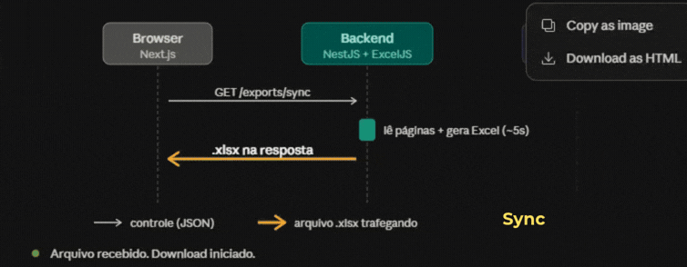
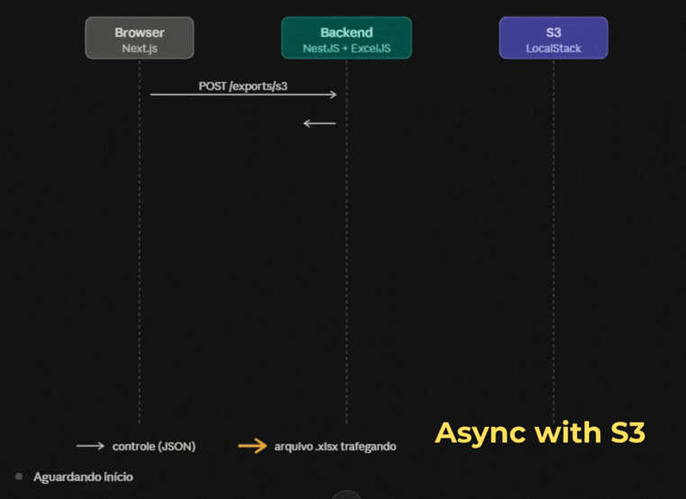
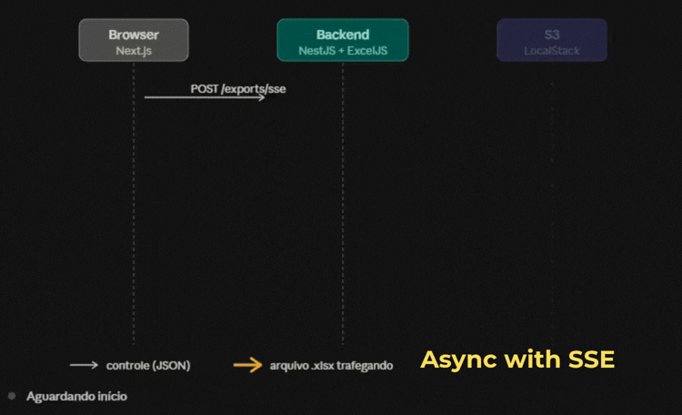

# Excel Export Demo


A small full-stack application for generating and downloading Excel (`.xlsx`) reports. It demonstrates three delivery strategies: a synchronous download, an asynchronous job backed by S3-compatible object storage, and an asynchronous job that reports progress over Server-Sent Events (SSE).

The repository contains a Next.js frontend and a NestJS API. The API currently uses a fake data source that generates 50,000 sample rows in pages of 5,000, then creates a workbook with ExcelJS.

## Project structure

```text
frontend/   Next.js user interface
backend/    NestJS API and export implementations
```

## Requirements

- Node.js and npm
- An S3-compatible service and a bucket for the S3 export option (for example, AWS S3 or a local S3-compatible emulator)

## Configuration

Create `frontend/.env.local` with the API URL:

```dotenv
NEXT_PUBLIC_API_URL=http://localhost:3001
```

Create `backend/.env` with the API and S3 settings:

```dotenv
PORT=3001
AWS_REGION=us-east-1
AWS_ENDPOINT=http://localhost:4566
AWS_ACCESSKEY=test
AWS_ACCESSKEY_SECRET=test
S3_BUCKET=exports
```

Use the endpoint, region, credentials, and bucket appropriate for your S3-compatible service. The bucket must already exist. For AWS S3, configure credentials with appropriate permissions to upload objects and retrieve signed download URLs. Keep real credentials out of version control.

The frontend allows requests from `http://localhost:3000` through the API's current CORS configuration.

## Run locally

Start the API in one terminal:

```bash
cd backend
npm install
npm run start:dev
```

Start the frontend in another terminal:

```bash
cd frontend
npm install
npm run dev
```

Open [http://localhost:3000](http://localhost:3000). The API listens on port `3001` by default; set `PORT` to change it.

## Export strategies

| Strategy | API flow | File delivery |
| --- | --- | --- |
| Synchronous | `GET /exports/sync` | The API generates and returns the workbook in the response. |
| Asynchronous with S3 | `POST /exports/s3`, then poll `GET /exports/s3/:id` | The API uploads the completed workbook to S3 and returns a time-limited signed URL. |
| Asynchronous with SSE | `POST /exports/sse`, then subscribe to `GET /exports/sse/:id/events` | Progress and completion are sent as SSE events; download the file from `GET /exports/sse/:id/download`. |

#### Synchronous download
 <br>

#### Asynchronous download (S3)
 <br>

#### Asynchronous download (SSE)
 <br>

The S3 and SSE job state is held in memory, so active jobs are lost when the API process restarts. The SSE strategy keeps the generated workbook in memory as well.

## Suggested improvements

The current implementation is a demonstration: it uses generated sample data, stores job state in process memory, and builds the workbook as a buffer. The following changes would make it more resilient and scalable:

1. **Use DynamoDB for export data.** Replace `FakeDataAdapter` with a DynamoDB-backed adapter that reads records page by page using `Query` or `Scan` with `LastEvaluatedKey`. Prefer queries against a suitable partition key and secondary index over full-table scans for production workloads. The repository includes a LocalStack initialization script for a DynamoDB table, but the export code does not currently use it.
2. **Move job state and coordination to Redis.** Replace the in-memory job store with Redis so status and progress survive API restarts and are shared across multiple API instances. Set a TTL for completed and failed jobs. Redis Pub/Sub or Streams can carry progress updates to SSE connections; a queue such as BullMQ can manage background execution, retries, and concurrency limits.
3. **Run exports in background workers.** Have the API create a job and return its ID, while independent workers fetch data, generate the report, and upload it to S3. This keeps long-running work away from HTTP request processes and allows worker capacity to scale separately.
4. **Stream large workbooks to object storage.** Use ExcelJS's streaming workbook writer and multipart upload instead of holding the entire workbook in a `Buffer`. This reduces memory use for large exports.
5. **Harden job lifecycle and downloads.** Persist creation time and error details, add cancellation and timeouts, clean up expired S3 objects, validate job ownership, and use configurable signed URL expiry. Add observability for queue depth, processing time, failures, and memory use.

## Useful commands

Frontend (`cd frontend`):

```bash
npm run dev
npm run build
npm run start
npm run lint
```

Backend (`cd backend`):

```bash
npm run start:dev
npm run build
npm run start:prod
npm run test
npm run test:e2e
```
